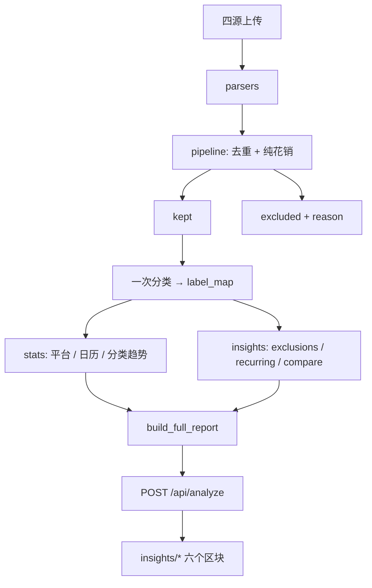

# FlowCanvas 分析增强功能 Spec

> 对应规划文档：`docs/分析增强规划.md`  
> 目标：将六项分析增强功能落地为可开发的任务规格。

---

## 功能清单

| 编号 | 功能 | 优先级 | 后端模块 | 前端组件 |
|------|------|--------|----------|----------|
| F1 | 分类月度堆叠图 | P1 | `stats.category_trend` | `CategoryStackSection` |
| F2 | 消费日历热力图 | P1 | `stats.daily_spending_map` | `SpendingCalendarSection` |
| F3 | 剔除项明细 | P0 | `pipeline` + `insights/exclusions` | `ExcludedDetailSection` |
| F4 | 平台占比 | P0 | `stats.platform_breakdown` | `PlatformShareSection` |
| F5 | 固定/订阅识别 | P2 | `insights/recurring` | `RecurringSection` |
| F6 | 跨期对比 | P3 | `insights/compare`（或纯前端） | `PeriodCompareSection` |

---

## F1 分类月度堆叠图

### 输入
- `periods: list[PeriodPayload]`（已有，含 `categories`）
- `label_map: dict[tuple, str]`（全年交易分类结果）

### 输出（新增到 `build_full_report`）
```python
"categoryTrend": {
    "keys": ["2026-01", "2026-02", ...],
    "series": [
        {"name": "餐饮食品", "amounts": [1200.0, 980.0, ...]},
        {"name": "游戏动漫", "amounts": [800.0, 1500.0, ...]},
        ...
    ]
}
```

### 实现
- `stats.category_trend(period_payloads) -> dict`：从 `periods[].categories` 转置为按类别的时间序列
- 或：直接对 `kept` 按 `(month, category)` 二次聚合，复用 `label_map`

### 前端
- `charts/StackedBarChart.tsx`：Recharts `BarChart` + `stackId`
- `insights/CategoryStackSection.tsx`：绝对值 / 100% 切换按钮

---

## F2 消费日历热力图

### 输入
- `kept: list[Txn]`

### 输出
```python
"spendingCalendar": {
    "days": [
        {"date": "2026-01-05", "amount": 234.5, "count": 3},
        ...
    ],
    "maxAmount": 1500.0
}
```

### 实现
- `stats.daily_spending_map(txns) -> dict`：按 `Txn.dt` 聚合 `{date: {amount, count}}`

### 前端
- `charts/HeatmapCalendar.tsx`：按月分块，CSS 变量控制色阶
- `insights/SpendingCalendarSection.tsx`：悬停 tooltip，点击展开当日明细（可选二期）

---

## F3 剔除项明细

### 输入
- `excluded: list[Txn]`（当前无 reason 字段）

### 改动
1. **pipeline.py**：`apply_pure_filter` 返回 `(kept, excluded_with_reason)`  
   - `excluded` 每项附加 `reason: str`（如 `"transfer"` / `"rent"` / `"non_spending"` / `"wechat_transfer"`）
2. **insights/exclusions.py**：`build_excluded_detail(excluded) -> dict`

### 输出
```python
"excludedDetail": {
    "summary": {"count": 45, "amount": 12345.0},
    "groups": [
        {
            "reason": "transfer",
            "label": "转账/红包",
            "count": 20,
            "amount": 5000.0,
            "items": [{"date", "platform", "description", "amount"}, ...]
        },
        ...
    ]
}
```

### 前端
- `insights/ExcludedDetailSection.tsx`：汇总卡片 + 可展开分组表格

---

## F4 平台占比

### 输入
- `kept: list[Txn]`

### 输出
```python
"platformShare": [
    {"platform": "支付宝", "amount": 5000.0, "count": 120, "pct": 45.2},
    {"platform": "微信", "amount": 3000.0, "count": 80, "pct": 27.1},
    ...
]
```

### 实现
- `stats.platform_breakdown(txns) -> list[dict]`：按 `Txn.platform` 分组

### 前端
- `charts/DonutChart.tsx`：Recharts `PieChart` + 中心显示总额
- `insights/PlatformShareSection.tsx`：与 `meta.sources` 联动标注「未上传」

---

## F5 固定/订阅识别

### 输入
- `kept: list[Txn]`
- `label_map: dict[tuple, str]`
- `cfg: dict`（`category_rules` 中会员类关键词）

### 算法
1. 按 `catalog_group_key` 分组
2. 对每组检测：
   - 时间间隔：相邻交易间隔 28–35 天（月付）或 85–95 天（季付）
   - 金额稳定性：波动 < 10%
   - 类别：优先「会员订阅」
3. 输出置信度：`high`（规则命中 + 周期稳定）/ `medium`（仅周期稳定）

### 输出
```python
"recurring": [
    {
        "label": "iCloud",
        "category": "会员订阅",
        "amount": 6.0,
        "cadence": "monthly",
        "annualEst": 72.0,
        "confidence": "high",
        "lastDate": "2026-08-15"
    },
    ...
]
```

### 前端
- `insights/RecurringSection.tsx`：表格 + 置信度标签 + 年化估算

---

## F6 跨期对比

### 一期（纯前端）
- 用现有 `periods` 选两段，前端计算 diff
- 组件：`PeriodCompareSection.tsx` + 两个下拉选择器

### 二期（后端）
- `insights/compare.py`：`compare_periods(a: PeriodPayload, b: PeriodPayload) -> dict`
- 输出：
```python
"compare": {
    "a": {"key": "2026-07", "total": 5000, ...},
    "b": {"key": "2026-08", "total": 6000, ...},
    "delta": {"total": 1000, "totalPct": 20.0, "count": 5, ...},
    "categoryDeltas": [{"name", "amountA", "amountB", "delta", "deltaPct"}, ...]
}
```

---

## 数据流（最终形态）



---

## 实施顺序

| 阶段 | 功能 | 改动文件 |
|------|------|----------|
| 一期 | F4 平台占比、F3 剔除明细 | `stats.py`、`pipeline.py`、`insights/exclusions.py`、前端 2 组件 |
| 二期 | F1 分类堆叠、F2 消费日历 | `stats.py`、前端 2 组件 |
| 三期 | F5 订阅识别 | `insights/recurring.py`、前端 1 组件 |
| 四期 | F6 跨期对比 | `insights/compare.py`（或纯前端）、前端 1 组件 |

---

## 测试

- `test_stats_extensions.py`：F1/F2/F4 聚合断言
- `test_insights_exclusions.py`：F3 剔除原因与分组
- `test_insights_recurring.py`：F5 周期检测用例
- `test_insights_compare.py`：F6 diff（后端化后）
