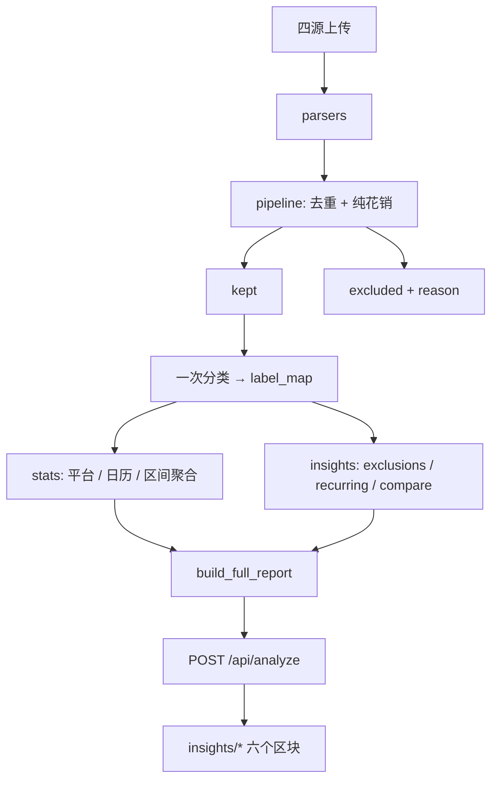

# FlowCanvas 分析增强规划

个人开销分析方向的优先功能说明。按实现优先级排列。

---

## 1. 分类月度堆叠图

**是什么**  
以自然月（或当前所选小区间粒度）为横轴，纵轴为支出金额或占比，用堆叠柱/面积图展示各类别（餐饮、游戏动漫、购物等）的构成与变化。

**解决什么问题**  
现有「区间趋势」只看总额涨跌，看不出是「整体花多了」还是「某一类突然变多」。堆叠图能回答：结构是否偏移、哪一类在拖后腿或上涨。

**展现要点**  
- 绝对值模式：每月各类金额堆叠  
- 可选 100% 模式：看占比结构，不受总额波动干扰  
- 图例与现有分类配色一致，可点击隐藏某类  

**数据基础**  
`periods[].categories` 或按月在 `kept` 交易上二次聚合即可，分类标签复用现有 `label_map`。

---

## 2. 消费日历热力图

**是什么**  
按日历格子展示每日纯花销总额：颜色越深表示当天花得越多，空白或浅色表示无消费/很低。

**解决什么问题**  
表格里的「峰值日」不够直观。日历一眼能看出：是否周末集中消费、某几天是否异常、一个月里「乱花」集中在哪些日期。

**展现要点**  
- 按月分块或整段日期连续展示  
- 悬停显示：日期、金额、笔数  
- 点击某日可展开当日明细（可选，二期）  

**数据基础**  
`build_period_payload` 已产出 `daily` 序列；全年可按 `Txn.dt` 聚合为 `{ date → amount, count }`。

---

## 3. 剔除项明细

**是什么**  
在开启「纯花销模式」时，单独列出被规则剔除的交易：转账、房租、取现、理财等，含笔数、金额、剔除原因（匹配到的关键词或规则类型）。

**解决什么问题**  
用户看到「纯花销」总数时，常疑惑「和流水对不上」。透明展示剔除清单，便于核对规则是否误伤、总额是否可信。

**展现要点**  
- 汇总：剔除 N 笔、共 X 元  
- 分组：按剔除类型（转账 / 房租 / 非消费等）或按关键词  
- 可展开每笔：日期、平台、摘要、金额  

**数据基础**  
`collect_from_aggregate` 已返回 `excluded` 列表；需在 pipeline 或 report 层补充「剔除原因」字段（当前 note 仅为汇总文案）。

---

## 4. 平台占比

**是什么**  
展示四源流水（支付宝 / 微信 / 招行 / 中行）在纯花销中的金额与笔数占比，可用环形图或条形图。

**解决什么问题**  
FlowCanvas 的核心是「四源合并」。用户需要知道：钱主要从哪个 App/渠道流出，是否某平台数据缺失或偏少。

**展现要点**  
- 金额占比 + 笔数占比（两者可能不一致）  
- 与 `meta.sources` 解析状态联动：某源未上传时标注  
- 配色沿用现有 `PLATFORM_COLORS`  

**数据基础**  
对 `kept` 交易按 `Txn.platform` 或 `Txn.source` 分组统计即可。

---

## 5. 固定 / 订阅识别

**是什么**  
自动识别「像固定支出」的消费模式：同金额或近似金额、同摘要/收款方、按月（或按固定间隔）重复出现；重点突出会员订阅、自动扣费、周期性账单。

**解决什么问题**  
帮助区分「每月刚性开销」和「日常浮动开销」，回答：订阅一共扣多少、有没有重复会员、哪些可以取消。

**展现要点**  
- 列表：对象名、周期（月/季）、单次金额、年化估算、所属类别  
- 标记置信度（规则命中 vs 疑似）  
- 与「会员订阅」类别人工规则互补，不替代分类  

**数据基础**  
对 `catalog_group_key` 分组后，检测时间序列上的间隔与金额稳定性；可结合 `category_rules` 中会员类关键词提高准确率。

---

## 6. 跨期对比

**是什么**  
选择两个时间区间（如 2025-08 vs 2025-09，或 Q3 vs Q4）并排对比：总额、笔数、各类金额与占比、Top 变化项。

**解决什么问题**  
单次报告只看「这一段」。对比视图回答：比上月多了还是少了、哪一类变化最大、大额是否新增。

**展现要点**  
- 默认快捷项：相邻两月、最近月 vs 区间均值  
- 对比表：指标 | 区间 A | 区间 B | 差额 | 变化率  
- 可选小型分类堆叠对比图  

**数据基础**  
短期可在前端用现有 `periods` 选两段；长期若支持多次分析存档，需持久化历史 report 或原始聚合结果。

---

## 建议实现顺序

| 阶段 | 功能 | 说明 |
|------|------|------|
| 一期 | 平台占比、剔除项明细 | 数据现成或改动小，立刻提升可信度 |
| 二期 | 分类月度堆叠图、消费日历 | 补「结构 + 时间」两个核心视角 |
| 三期 | 固定/订阅识别 | 需简单周期检测，规则可迭代 |
| 四期 | 跨期对比 | 依赖区间选择 UI；完整体验需历史存档 |

---

## 功能全部集成后的目标架构

以下描述六项功能全部落地后的**最终模块划分与数据流**，与当前代码结构兼容，可按四期逐步实现。

### 分层原则

| 层 | 职责 | 现有模块 |
|----|------|----------|
| 解析 | 四源文件 → 统一交易 | `parsers/`、`merge.py` |
| 过滤 | 去重、退款冲销、纯花销剔除 | `pipeline.py` |
| 分类 | 关键词 / LLM / 学习模式 | `classifiers/` |
| 统计 | 通用聚合（平台、日历、区间等） | `stats.py` |
| 洞察 | 有独立算法的分析（剔除原因、订阅识别、跨期对比） | **新增 `insights/`** |
| 编排 | 组装完整报表 JSON | `report.py` |
| 界面 | 六大区块 + 现有 Dashboard | `web_frontend/src/components/insights/` |

**不做法**：六个功能 ≠ 六个后端包。简单 groupby 放 `stats.py`；有规则迭代、周期检测、diff 逻辑的才单独成 `insights` 模块。

### 后端目标目录

```
expense_core/
├── parsers/              # 不变
├── classifiers/          # 不变（learn 模式已含关键词学习）
├── pipeline.py           # 改：excluded 携带 reason（剔除原因）
├── stats.py              # 扩展：platform_breakdown、daily_spending_map、category_trend
├── insights/             # 新增目录
│   ├── __init__.py
│   ├── exclusions.py     # 剔除项分组：按 reason / 关键词 → 汇总与明细
│   ├── recurring.py      # 固定/订阅：周期 + 金额稳定性检测
│   └── compare.py        # 跨期：两区间指标 diff（可选，二期可先纯前端）
├── report.py             # 编排：调用 stats + insights，一次 analyze 返回全部
└── ...
```

### `build_full_report()` 扩展后的产出（一次请求）

```python
{
    "meta": {...},
    "periodTotals": [...],
    "categories": [...],
    "categoryDetails": [...],
    "amountBuckets": [...],
    "bucketCategories": [...],
    "largeTxns": [...],
    "periods": [...],

    # 新增六项
    "categoryTrend":   { "keys": [...], "series": [{ "name", "amounts" }] },   # 1
    "spendingCalendar": { "days": [{ "date", "amount", "count" }], "maxAmount" }, # 2
    "excludedDetail":  { "summary": {...}, "groups": [...] },                    # 3
    "platformShare":   [{ "platform", "amount", "count", "pct" }],              # 4
    "recurring":       [{ "label", "category", "amount", "cadence", "confidence" }], # 5
    # "compare": 见「跨期对比」小节
}
```

`classify_transactions` 仍只在**全年 kept** 上调用一次；`insights` 各模块统一消费 `label_map`，不重复调分类器。

### 六个功能与模块的对应关系

| 功能 | 后端模块 | 说明 |
|------|----------|------|
| 分类月度堆叠图 | `stats.category_trend` 或前端 reshape `periods` | 零新算法 |
| 消费日历热力图 | `stats.daily_spending_map` | 与 `daily_totals` 同源，换字典形式 |
| 剔除项明细 | `pipeline` 改 `excluded` + `insights/exclusions.py` | 唯一需要改 pipeline |
| 平台占比 | `stats.platform_breakdown` | 一行 groupby |
| 固定/订阅识别 | `insights/recurring.py` | 规则会迭代，单独文件 |
| 跨期对比 | `insights/compare.py`（二期）或前端 diff（一期） | 长期可加持久化 |

### 前端目标目录

```
web_frontend/src/components/
├── charts/                 # 可复用图表壳
│   ├── StackedBarChart.tsx # 分类趋势（1）
│   ├── HeatmapCalendar.tsx # 日历热力（2）
│   └── DonutChart.tsx      # 平台占比（4）
└── insights/               # 页面区块（与现有 dashboard/ 并列）
    ├── CategoryStackSection.tsx
    ├── SpendingCalendarSection.tsx
    ├── ExcludedDetailSection.tsx
    ├── PlatformShareSection.tsx
    ├── RecurringSection.tsx
    └── PeriodCompareSection.tsx
```

`App.tsx` 在有报告时按区块渲染；侧边栏 `NAV_ITEMS` 对应增加六个锚点（或并入现有「区间/分类/设置」语义分组）。

### 数据流（最终形态）



### 测试布局

- `test_stats_extensions.py` 或并入 `test_report.py`：平台、日历、分类趋势断言  
- `test_insights_exclusions.py`：剔除原因与分组  
- `test_insights_recurring.py`：同摘要、同金额、隔月等用例  
- `test_insights_compare.py`：两区间 diff（后端化后）

---

## 迁移路径小结

1. **一期**：`stats.platform_breakdown` + `pipeline` 剔除原因 + `insights/exclusions` + 前端两区块。  
2. **二期**：`stats.category_trend` / `daily_spending_map` + 堆叠图、日历组件。  
3. **三期**：`insights/recurring` + 订阅列表。  
4. **四期**：`insights/compare`（或纯前端）+ 区间选择 UI；可选持久化历史 report。

每次只动 `report.py` 组装层和对应 `stats` / `insights` 小模块，不破坏现有 Dashboard。
